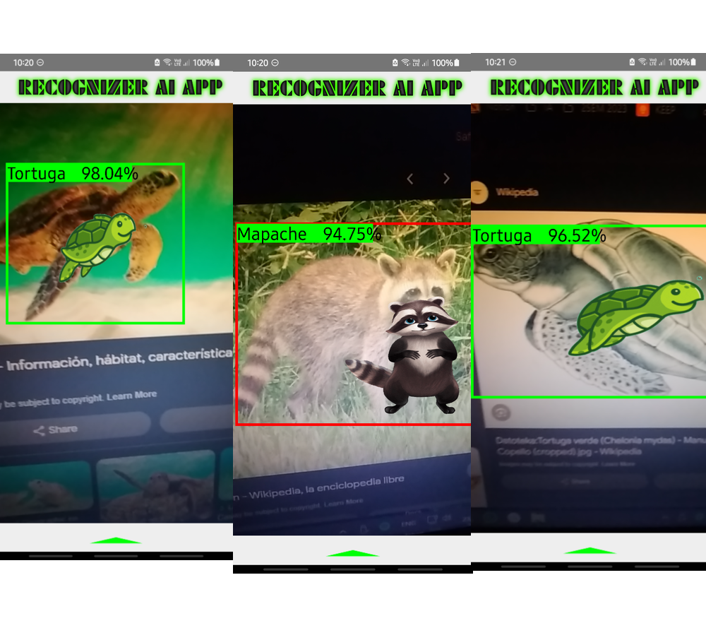
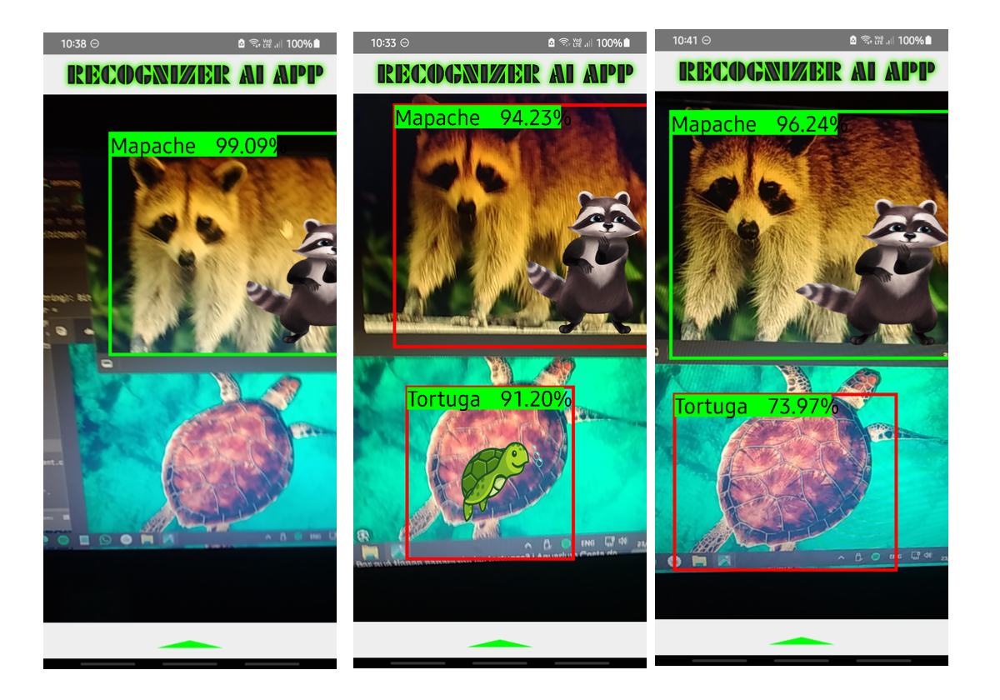

# Reconocimiento de Objetos con TensorFlow y MobileNet V2 🚀

## Comenzando 🚀

Aplicación Movil usando Kotlin y el lenguaje Python con uso de Android Studio para el despliegue de la Aplicacion.

    💻 Python

    😎 Modelos de Inteligencia Artificial

    🎃 Manipulación de APK

    🎇 Entrenamiento de Redes neuronales

    😎 Realidad Aumentada

### Pre-requisitos 📋

Navegador

## Descripción: 📌

Este proyecto tiene como objetivo el reconocimiento de objetos utilizando TensorFlow y el modelo MobileNet V2. Desarrollado y entrenado en Python utilizando Android Studio para crear la aplicacion, el modelo ha sido entrenado con un conjunto de datos robusto, alcanzando una precisión notable después de 100,000 pasos de entrenamiento.

## Características: ✒️

- **Modelo**: MobileNet V2
- **Entorno de Desarrollo**: Visual Studio
- **APK**: Android Studio
- **Pasos de Entrenamiento**: 100,000
- **Buffer de Entrenamiento**: 16

## Funcionalidades: 🛠️

- Detección precisa de múltiples objetos en tiempo real.
- Integración fácil y rápida con otros sistemas y aplicaciones.
- Alta eficiencia y rendimiento gracias al modelo ligero MobileNet V2.

## Cómo usar: 📦

## Instalar el APK: 🤖

1. **Descargar e instalar**:
   ```bash
   https://github.com/Alvaro-SP/Image-Recog-Tensorflow/blob/main/app-debug.apk
   ```

## Depurar y Compilar el APK: 🤖

1. **Instalación de Dependencias**:

   ```bash
   pip install tensorflow
   ```

2. **Clonar el Repositorio**:

   ```bash
   git clone https://github.com/Alvaro-SP/Image-Recog-Tensorflow.git
   ```

3. **Ejecutar el Código**:
   ```bash
   cd "Android Studio App/android"
   <abrir con Android Studio>
   ```

## Capturas de Pantalla: 🖥️





