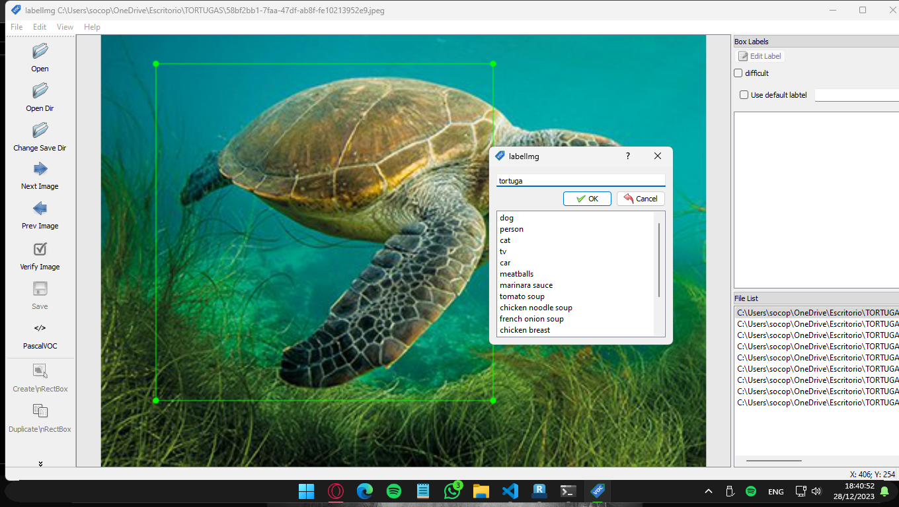

# ESPECIFICACIONES TECNICAS

## Descripción del Proyecto

La detección de objetos es una técnica de aprendizaje automático que identifica y localiza objetos dentro de imágenes. Este proyecto utiliza un modelo entrenado en el conjunto de datos COCO, un extenso conjunto de imágenes con más de 80 categorías de objetos.

# Uso de MobileNetV2 Lite en la Detección de Objetos

## Introducción a MobileNetV2 Lite

MobileNetV2 Lite es una versión optimizada y ligera de MobileNetV2, diseñada específicamente para dispositivos con recursos limitados, como smartphones y dispositivos IoT. Esta variante mantiene una precisión razonable mientras reduce significativamente el tamaño y los requisitos computacionales del modelo original.

## Características Principales

- **Eficiencia**: MobileNetV2 Lite mantiene la arquitectura eficiente de MobileNetV2, pero con menos parámetros y operaciones, lo que resulta en una menor carga computacional.
- **Tamaño Reducido**: El modelo está diseñado para tener un tamaño más pequeño en comparación con MobileNetV2 estándar, lo que lo hace ideal para aplicaciones móviles donde el espacio de almacenamiento es una consideración importante.
- **Rendimiento Aceptable**: A pesar de su tamaño reducido, MobileNetV2 Lite ofrece un rendimiento decente en tareas de visión por computadora, incluida la detección de objetos.

## Integración en el Proyecto de Detección de Objetos

En el contexto del proyecto de detección de objetos en Android utilizando TensorFlow Lite, MobileNetV2 Lite se considera como una opción alternativa o complementaria a los modelos EfficientDet Lite.

### Ventajas en el Proyecto

- **Compatibilidad**: TensorFlow Lite ofrece soporte directo para MobileNetV2 Lite, lo que facilita su integración en aplicaciones Android.
- **Rendimiento Adecuado**: Para ciertas aplicaciones o escenarios donde la velocidad de inferencia es crítica y se puede sacrificar una pequeña cantidad de precisión, MobileNetV2 Lite puede ser una excelente elección debido a su rapidez y eficiencia.

Utilizamos el modelo `Mobilenet V2` por su equilibrio entre tamaño y precisión.


## Requisitos del Sistema

- Android Studio versión 2021.1.1 o superior.
- Android SDK versión 31 o superior.
- Dispositivo Android con versión mínima SDK 24 (Android 7.0 - Nougat) y modo desarrollador activado.

## Configuración y Ejecución

Para el entrenamiento se utilizo el siguiente codigo:


[Primer codigo implementado](https://colab.research.google.com/drive/16wSUC2kF_f4yhhn6DqkHsjnNIEQIExQB?usp=sharing)

El ultimo codigo implementado se encuentra en el archivo:

[Training_Model_with_Tensorflow](/Training_Model_with_Tensorflow_Lite_Mobilenet_v2.ipynb)

y para agregar la metadata para conocer las entradas y salidas se ha utilizado codigo que nos proporciona la documentacion oficial y que con ello pueda ser reconocido por visual studio para utilizar nuestro modelo:

[ADD METADATA DOCU](https://colab.research.google.com/drive/1fLRrcDx1dwdgCtp1dBqVJQirII3GdzC6?usp=sharing)

## Dependencias Necesarias

Para integrar TensorFlow Lite en un proyecto Android, es esencial incluir las siguientes dependencias:

### 1. Bibliotecas de TensorFlow Lite

Estas son las bibliotecas principales que permiten cargar, ejecutar y trabajar con modelos de TensorFlow Lite en dispositivos Android.

- **TensorFlow Lite Core**: Proporciona las funcionalidades básicas para cargar y ejecutar modelos TFLite en Android.
- **TensorFlow Lite GPU Delegate**: Esta es una extensión específica que aprovecha la aceleración de GPU para ejecutar inferencias de manera más rápida, especialmente útil para modelos complejos o tareas intensivas.

### 2. Dependencias de Aceleración de GPU

La aceleración de GPU permite que las operaciones de inferencia del modelo se ejecuten utilizando el procesador gráfico del dispositivo, lo que puede resultar en tiempos de respuesta más rápidos y un rendimiento mejorado.

- **Librerías de Aceleración de GPU**: Dependiendo del hardware y las capacidades del dispositivo, es posible que se requieran bibliotecas adicionales o drivers para habilitar y optimizar la aceleración de GPU con TensorFlow Lite.

## Integración en el Proyecto

Para agregar estas dependencias al proyecto Android, generalmente se utilizan herramientas de gestión de dependencias como Gradle. Aquí hay un ejemplo básico de cómo se vería una configuración de dependencias en el archivo `build.gradle` del módulo de la aplicación:

```groovy
dependencies {
    // Dependencias básicas de TensorFlow Lite
    implementation 'org.tensorflow:tensorflow-lite:2.x.x'

    // Dependencia para la aceleración de GPU (si es necesario)
    implementation 'org.tensorflow:tensorflow-lite-gpu:2.x.x'
}
```

## Inicialización del Modelo

El proceso de inicialización del modelo TensorFlow Lite se detalla paso a paso, desde la selección del modelo hasta la configuración de opciones y delegados de hardware.

## Preparación de Datos

Se recolectaron varias imagenes y se subieron a la plataforma roboflow ya con sus pesos ponderados utilizando labelImg.


Con labelImg se ha seleccionado el area de reconocimiento para el ObjectDetection necesario y que nuestro modelo pueda entrenar:



Para despues ser utilizado en nuestro codigo ya subido a roboflow.

## Ejecución de Predicciones

Se realizaron las predicciones en android studio

